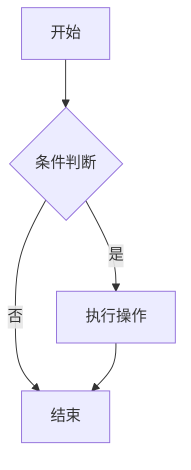
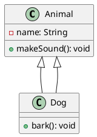

# Markdown Preview

一个功能丰富的 Markdown 编辑器，支持 WYSIWYG（所见即所得）编辑模式和双栏预览模式，包含数学公式、代码高亮、图表渲染等高级功能。

## 功能特性

### 编辑模式

- **WYSIWYG 模式**：所见即所得的富文本编辑体验
  - 实时渲染 Markdown 语法
  - 快捷键支持：`Ctrl/Cmd+B`（加粗）、`Ctrl/Cmd+I`（斜体）、`Ctrl/Cmd+E`（行内代码）
  - 块级元素快捷输入：`# ` 创建标题、`- ` 创建列表、``` 创建代码块等
  - 撤销/重做支持：`Ctrl/Cmd+Z` 撤销、`Ctrl/Cmd+Shift+Z` 或 `Ctrl/Cmd+Y` 重做
  - 查找功能：`Ctrl/Cmd+F` 打开查找工具栏

- **双栏预览模式**：左侧编辑 Markdown，右侧实时预览

### 代码编辑器

- **Monaco Editor 集成**：专业的代码编辑体验
- **语法高亮**：支持 25+ 编程语言
  - 前端：JavaScript、TypeScript、HTML、CSS、SCSS、Less
  - 后端：Python、Java、PHP、Ruby、Go、Rust
  - 移动端：Swift、Kotlin
  - 系统：C++、C#
  - 数据：SQL、YAML、XML
  - 其他：Shell、Markdown、Dockerfile 等
- **语言切换**：代码块支持实时切换编程语言
- **智能滚动**：滚轮事件正确冒泡到父级容器

### 图表渲染

- **Mermaid 图表**：流程图、时序图、甘特图、类图等
- **PlantUML 图表**：类图、用例图、活动图、组件图等
- **Monaco 编辑器支持**：图表编辑器同样使用 Monaco 编辑器

### 数学公式

- 使用 KaTeX 渲染 LaTeX 数学公式
- 支持行内公式（`$...$`）和块级公式（`$$...$$`）

### 标题大纲

- **实时生成**：自动提取文档中的 H1-H6 标题
- **智能过滤**：排除代码块内的 `#` 注释
- **点击定位**：点击大纲项自动滚动到对应位置
- **固定定位**：大纲区域在滚动时保持可见
- **内部滚动**：大纲内容过长时支持独立滚动

### 文件操作

- **打开文件**：支持打开本地 `.md` 和 `.markdown` 文件
- **保存文件**：支持保存为 Markdown 文件
- **快捷键**：`Ctrl/Cmd+O` 打开、`Ctrl/Cmd+S` 保存

### 其他特性

- **GitHub 风格 Markdown**：支持 GitHub Flavored Markdown (GFM)
- **表格支持**：完整的表格渲染和编辑
- **列表嵌套**：支持有序/无序列表多级嵌套，Tab 键缩进
- **响应式设计**：适配桌面端、平板等不同屏幕尺寸

## 技术栈

| 类别 | 技术 |
|------|------|
| 框架 | React 18+、TypeScript |
| 构建 | Vite 5 |
| 桌面 | Electron |
| 样式 | Tailwind CSS |
| Markdown | react-markdown、remark-gfm、remark-math |
| 代码编辑 | Monaco Editor |
| 代码高亮 | rehype-highlight |
| 数学公式 | KaTeX (rehype-katex) |
| 图表渲染 | Mermaid、PlantUML |

## 安装和运行

### 安装依赖

```bash
npm install
```

### Web 开发模式

```bash
npm run dev
```

Web 应用将在 `http://localhost:33100` 启动。

### 桌面应用开发模式

**方式一：一键启动（推荐）**

同时启动 Vite 开发服务器和 Electron 桌面应用：

```bash
npm run desktop:dev
```

**方式二：分步启动**

先启动开发服务器：

```bash
npm run dev
```

然后在另一个终端启动桌面应用：

```bash
npm run desktop
```

### 桌面应用预览模式

不使用开发服务器，直接运行构建后的桌面应用：

```bash
npm run desktop:preview
```

### 生产构建

```bash
npm run build
```

### 运行测试

```bash
npm run test
```

### 代码检查

```bash
npm run lint
```

## 使用说明

### 模式切换

使用顶部的下拉菜单切换编辑模式：
- **WYSIWYG**：所见即所得编辑模式
- **Dual Pane**：双栏预览模式

### WYSIWYG 快捷键

| 快捷键 | 功能 |
|--------|------|
| `Ctrl/Cmd+B` | 加粗 |
| `Ctrl/Cmd+I` | 斜体 |
| `Ctrl/Cmd+E` | 行内代码 |
| `Ctrl/Cmd+F` | 打开查找工具栏 |
| `Ctrl/Cmd+Z` | 撤销 |
| `Ctrl/Cmd+Shift+Z` | 重做 |
| `Ctrl/Cmd+Y` | 重做 |
| `Ctrl/Cmd+O` | 打开文件 |
| `Ctrl/Cmd+S` | 保存文件 |
| `Tab` | 列表项缩进 |
| `Shift+Tab` | 列表项减少缩进 |

### 块级元素快捷输入

在 WYSIWYG 模式下，输入以下内容后按空格键：

| 输入 | 结果 |
|------|------|
| `# ` | 一级标题 |
| `## ` | 二级标题 |
| `### ` | 三级标题 |
| `- ` | 无序列表 |
| `1. ` | 有序列表 |
| `> ` | 引用块 |
| ``` | 代码块 |
| `---` | 分割线 |

### 数学公式

```markdown
行内公式：$E = mc^2$

块级公式：
$$
\int_{-\infty}^\infty e^{-x^2} dx = \sqrt{\pi}
$$
```

### Mermaid 图表



### PlantUML 图表



### 代码块

代码块支持语法高亮和语言切换：

```typescript
function greet(name: string): string {
  return `Hello, ${name}!`;
}

console.log(greet('World'));
```

点击代码块左上角的语言标签可以切换编程语言。

## 项目结构

```
├── src/
│   ├── components/
│   │   ├── MarkdownInput.tsx       # Markdown 文本输入组件
│   │   ├── MarkdownPreview.tsx     # Markdown 预览组件
│   │   └── WysiwygEditor.tsx       # WYSIWYG 编辑器组件
│   ├── shell/
│   │   └── desktop-app-shell.tsx   # 桌面应用壳组件
│   ├── utils/
│   │   ├── markdownDocumentModel.ts # Markdown 文档模型
│   │   ├── markdownFileIO.ts       # 文件读写工具
│   │   ├── wysiwygBlockInputRules.ts # 块级输入规则
│   │   └── wysiwygInlineStyleRules.ts # 行内样式规则
│   ├── types/
│   │   ├── monaco-basic-languages.d.ts # Monaco 语言类型声明
│   │   ├── plantuml-encoder.d.ts   # PlantUML 编码器类型
│   │   ├── remark-mermaid.d.ts     # Mermaid 插件类型
│   │   └── remark-plantuml.d.ts    # PlantUML 插件类型
│   ├── __tests__/
│   │   ├── App.test.tsx            # 应用集成测试
│   │   ├── MarkdownInput.test.tsx  # 输入组件测试
│   │   ├── MarkdownPreview.test.tsx # 预览组件测试
│   │   ├── markdownDocumentModel.test.ts # 文档模型测试
│   │   ├── markdownFileIO.test.ts  # 文件 IO 测试
│   │   ├── wysiwygBlockInputRules.test.ts # 块级规则测试
│   │   ├── wysiwygDodRegression.test.tsx # 回归测试
│   │   └── wysiwygInlineStyleRules.test.ts # 行内样式测试
│   ├── App.tsx                     # Web 主应用组件
│   ├── desktop.tsx                 # 桌面应用入口
│   ├── index.css                   # 全局样式
│   └── main.tsx                    # Web 应用入口
├── electron/
│   ├── main.cjs                    # Electron 主进程
│   └── preload.cjs                 # Electron 预加载脚本
├── desktop.html                    # 桌面应用 HTML 入口
└── index.html                      # Web 应用 HTML 入口
```

## 许可证

MIT License
