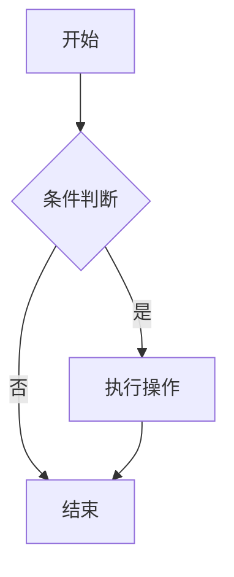
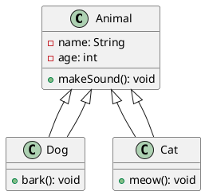

# Markdown Preview

一个简单的 Markdown 预览工具，支持实时编辑和预览 Markdown 文档，包含数学公式、代码高亮和图表渲染功能。

## 功能特性

- **实时预览**：输入 Markdown 文本后立即在右侧显示预览效果
- **数学公式支持**：使用 KaTeX 渲染 LaTeX 数学公式
- **代码高亮**：支持多种编程语言的代码高亮显示
- **图表渲染**：
  - Mermaid 图表（流程图、时序图、甘特图等）
  - PlantUML 图表（类图、用例图、活动图等）
- **GitHub 风格 Markdown**：支持 GitHub Flavored Markdown (GFM)
- **响应式设计**：适配不同屏幕尺寸

## 技术栈

- React 17+
- TypeScript
- Vite 构建工具
- React Markdown（Markdown 解析）
- KaTeX（数学公式渲染）
- Highlight.js（代码高亮）
- Mermaid（图表渲染）
- Tailwind CSS（样式框架）

## 安装和运行

### 安装依赖

```bash
npm install
```

### 开发模式

```bash
npm run dev
```

应用将在 `http://localhost:33100` 启动。

### 生产构建

```bash
npm run build
```

### 运行测试

```bash
npm run test
```

## 使用说明

### 基本使用

1. 在左侧输入框中输入 Markdown 文本
2. 右侧会实时显示预览效果
3. 使用顶部的按钮可以清除内容或重置为示例文本

### 数学公式

使用 `$$` 包裹行内公式，或 `$$` 包裹块级公式：

```markdown
行内公式：$E = mc^2$

块级公式：
$$
\int_{-\infty}^\infty e^{-x^2} dx = \sqrt{\pi}
$$
```

### 图表渲染

#### Mermaid 图表

```markdown

```

#### PlantUML 图表

```markdown

```

### 代码高亮

支持多种编程语言的代码高亮：

```markdown
```typescript
function greet(name: string): string {
  return `Hello, ${name}!`;
}

console.log(greet('World'));
```
```

## 项目结构

```
src/
├── components/
│   ├── MarkdownInput.tsx       # 文本输入组件
│   ├── MarkdownPreview.tsx     # 预览组件
│   └── ButtonGroup.tsx         # 按钮组组件
├── __tests__/
│   ├── App.test.tsx            # 应用测试
│   ├── MarkdownInput.test.tsx  # 输入组件测试
│   └── MarkdownPreview.test.tsx # 预览组件测试
├── App.tsx                     # 主应用组件
└── main.tsx                    # 应用入口
```

## 许可证

MIT License
